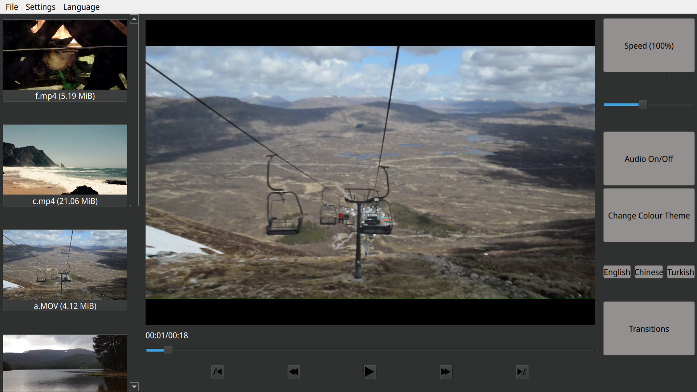

# *Video Player*

A small video player created in C++ by a team of 5 developers is a software application designed to play video files on a computer.

## Startup
* On startup, you will be asked to either provide the app with videos. You can press **Open File** or **Open Folder**, or quit the app and provide the path to a folder of videos as a command-line argument.

## Keyboard shortcuts
Main Player:
* `Space`: Play/Pause
* `Left/Right Arrows`: Fast-forward/Rewind 5 seconds.
* `Ctrl + Left/Right Arrows`: Fast forward/rewind by 1 frame. Useful for finding exact moments of contact and such.

Files:
* `Ctrl + O`: Open a video file.
* `Ctrl + Shift + O`: Open a folder of videos.

Interface:
* `Ctrl + L`: Switch between light & dark modes.

## Main screen

* **Menu Bar**: The bar at the top of the window contains the **File** menu, where individual videos or folders of videos can be opened, and a **Settings** menu, where a light/dark theme can be chosen, and a **Language** menu to select your desired language.
* **Left Side Bar**: On the left, a panel containing all videos in the current folder along with a thumbnail image and extra information is shown. Clicking on a video will open it in the main player.
* **Main player (centre)**: Here the currently selected video is shown, along with:
  * Seek bar: Shows the elapsed time of the video, its length, and a draggable slider to seek through it.
  * Play/Pause button.
  * Fast forward/Rewind: Skips forwards/backwards by 5 seconds. Distinguished by a double triangle icon
  * Frame skip forward/Back: Skip forwards/backwards by an individual frame. Icon contains $f_1$ to distinguish it from other buttons.
* **Right Side Bar**: Holds advanced controls for playback and editing functions. Note this may be hidden if the window is small, in which case press "Media" at the top of the window to open it.
  * **(Playback) Speed**: The rate at which the video is played backed can be adjusted from 0.25x-2x using the slider. Clicking the button will switch between 0.5x and 1x.
  * **Volume**: Adjusts the video's volume.
# video-interface-player
